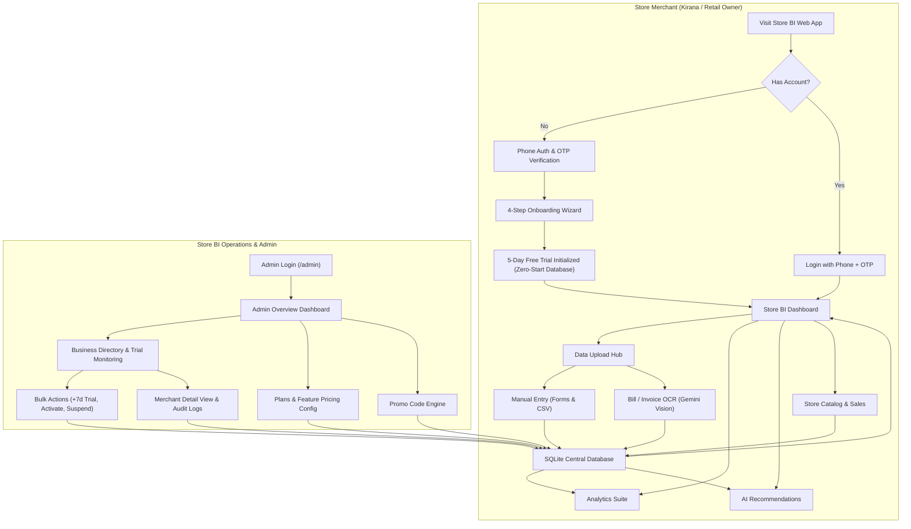
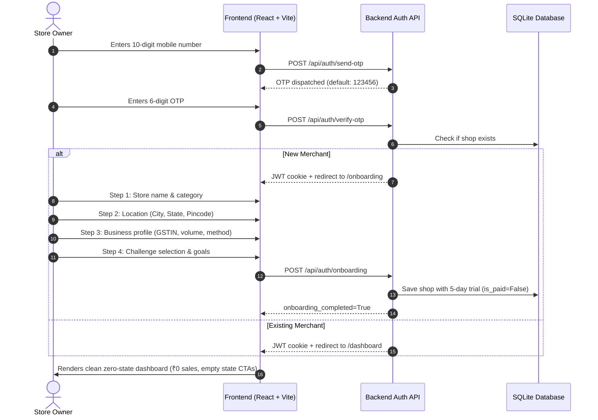
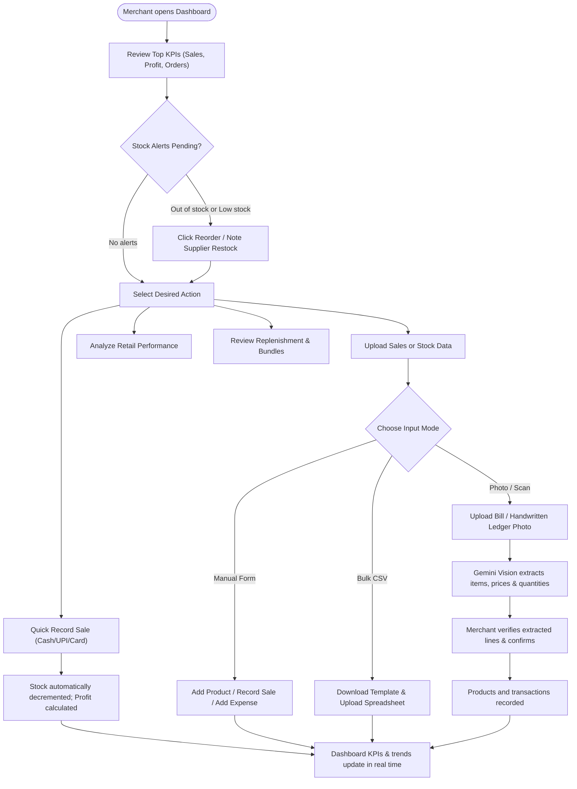
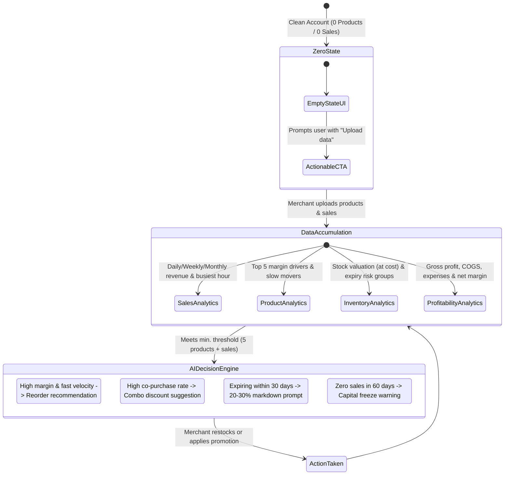
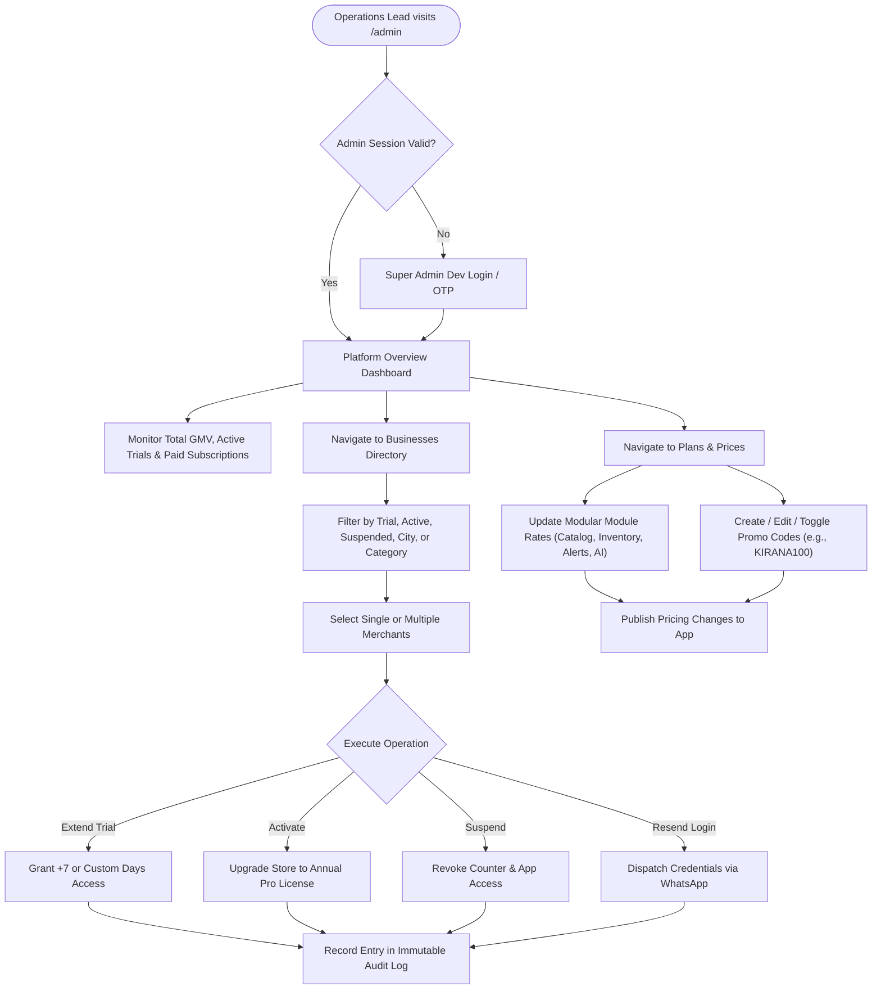

# Store BI User Flow

This document details the user journeys and core operational flows across the Store BI retail analytics platform for Indian kirana and retail merchants, as well as platform administrators.

---

## 1. High-Level System Architecture Flow

---

## 2. Merchant Onboarding & Zero-Start Flow

Every new account adheres to the **Zero-Start Rule**: no sample or fake demo data is injected. All metrics start cleanly at ₹0.

---

## 3. Daily Merchant Operations Flow

---

## 4. Analytics & AI Decision Workflow

---

## 5. Super Admin Operations Flow

